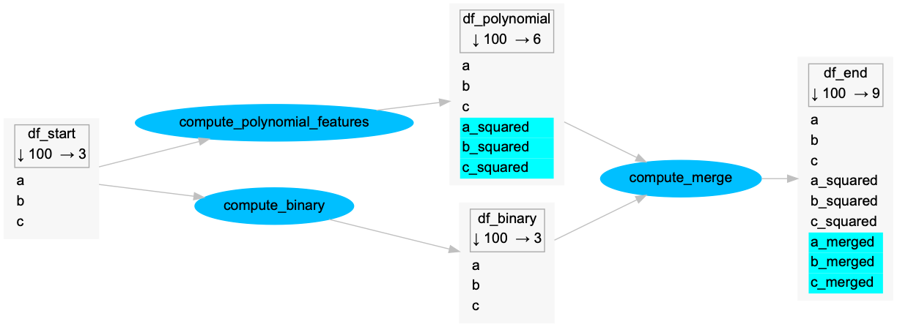

# Pandas pipeline in graphviz

Python package to build a nice explanative schema of a data processing pipeline in pandas.

It's heavily inspired by [dask's `.visualize` method](https://docs.dask.org/en/latest/graphviz.html), but improved with 2 useful features:
- visualize columns names in data nodes
- highlight created columns at each task

Here is an example from the [examples folder](examples):



## Installation

### Pip

Install with pip:
```bash
$ pip install pandas-pipeline-graphviz
```

### Manual installation

Install manually:
- git clone
- use `python setup.py`

## Usage

### Disclaimer

#### ⚠️ WARNING — it's a hack!

There are no reliable methods in python to get variables names, either as input or as output. The methods used in this package are quite _hacky_, as discussed in this [stackoverflow thread](https://stackoverflow.com/questions/2749796/how-to-get-the-original-variable-name-of-variable-passed-to-a-function).

To build the graph, this package makes use of:
- `globals()` **to get the names of input dataframes**, doing a comparison between the input dataframes and all the variables available in the global variables.
- `inspect.stack()` **to get the name of the output dataframe**, gathering the code lines calling the function and parsing it to find the output. Currently it supports only single-output transformations.

Both methods should be considered as experimental and the behavior of the decorator is expected to break easily if it's not used as presented in the [examples](examples).

#### Conditions for use

- do not use several decorators on your function, only this decorator, otherwise it will break the output dataframe name detection through `inspect.stack()`
- use only single output transformation functions, i.e. functions which return only 1 dataframe.

### Examples

See [examples folder](examples) in the repository.
